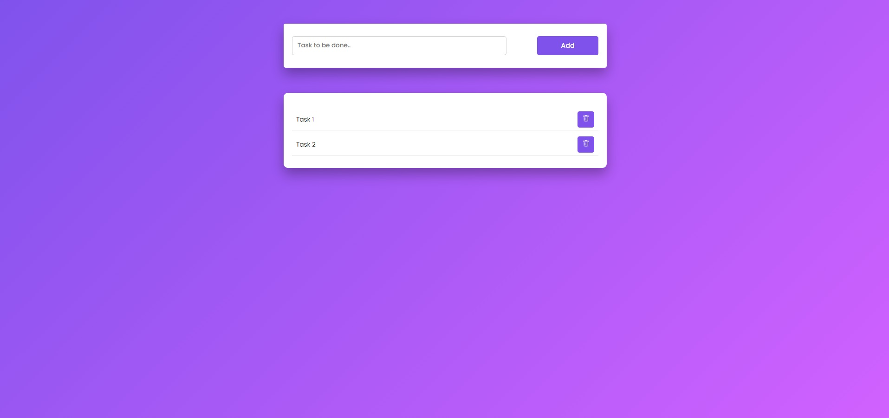

# Simple To-Do List

This project provides a simple To-Do List web application built using HTML, CSS, and JavaScript.

## Features

- **Adding Tasks:** Users can input tasks into the text field and click the "Add" button to add them to the list.
- **Deleting Tasks:** Each task item has a delete button associated with it, allowing users to remove tasks from the list.
- **Marking Tasks as Completed:** Users can mark tasks as completed by clicking on them. Clicking on a completed task again will unmark it.

## Usage

1. Clone the repository or download the source files.
2. Open the `index.html` file in your web browser.
3. Input tasks in the provided text field and click the "Add" button to add them to the list.
4. To delete a task, click on the associated delete button.
5. To mark a task as completed, click on the task. Clicking on a completed task again will unmark it.

## Preview

